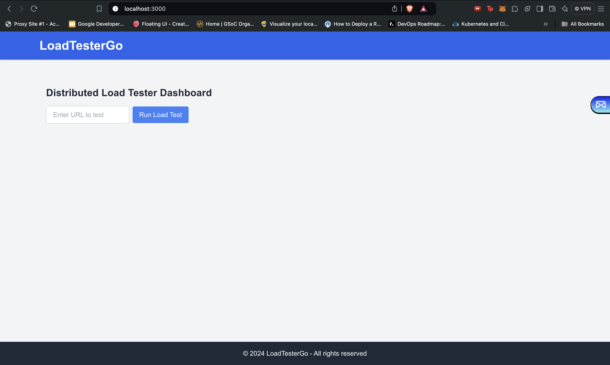
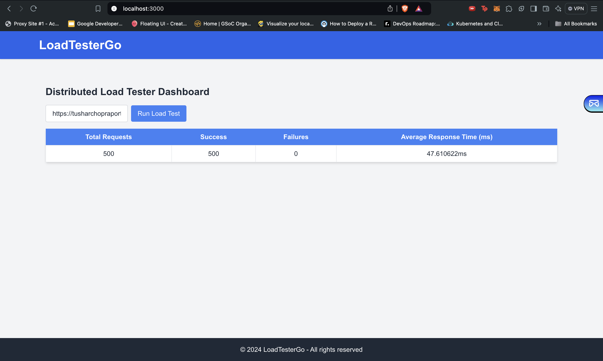

# LoadTesterGo

  


LoadTesterGo is a **distributed load testing tool** that allows you to simulate and monitor the performance of any target URL by sending concurrent requests and collecting metrics such as success rate, failure rate, and average response time. This tool is perfect for testing the robustness and scalability of web applications or APIs under varying levels of traffic.

## Features

- **Distributed Load Testing**: Simulate multiple workers to send a large number of requests to a target URL.
- **Real-time Metrics**: Display key metrics like total requests, successes, failures, and average response time.
- **Interactive UI**: Input a URL to test and view the results in an easy-to-read table format.
- **Fully Customizable**: Adjust the number of workers and requests per worker to test under different load conditions.

## Project Structure

The project is divided into two main folders:

1. **backend**: The Go backend responsible for performing the load tests.
2. **frontend**: The Next.js frontend for the user interface, where users can input a target URL and view the results of the load tests.

## Prerequisites

Before running the project, ensure you have the following installed:

- **Go (1.18 or above)**
- **Node.js (16.x or above)**
- **npm** or **Yarn** (For installing frontend dependencies)

---

## Frontend Setup Guide

To set up the **frontend**, follow these steps:

### 1. Navigate to the frontend folder:

```bash
cd frontend
```

### 2. Install dependencies

```bash
npm i
```

### 3. Create a .env.local file in the frontend folder with the following content:

```bash
BACKEND_URL=http://localhost:8080
```

### 4. Start the Next.js development server:

```bash
npm run dev
```

## Backend Setup Guide

To set up the **backend**, follow these steps:

### 1. Navigate to the backend folder:

```bash
cd backend
```

### 2. Install dependencies and build the Go backend:

```bash
go mod tidy
```

### 3. Create a .env file in the backend folder with the following contents:

```bash
WORKER_COUNT=5
REQUESTS_PER_WORKER=100
```

- WORKER_COUNT: The number of concurrent workers.
- REQUESTS_PER_WORKER: The number of requests each worker will send.

### 4. Run the backend server:

```bash
go run ./cmd/load-tester-go/main.go
```
